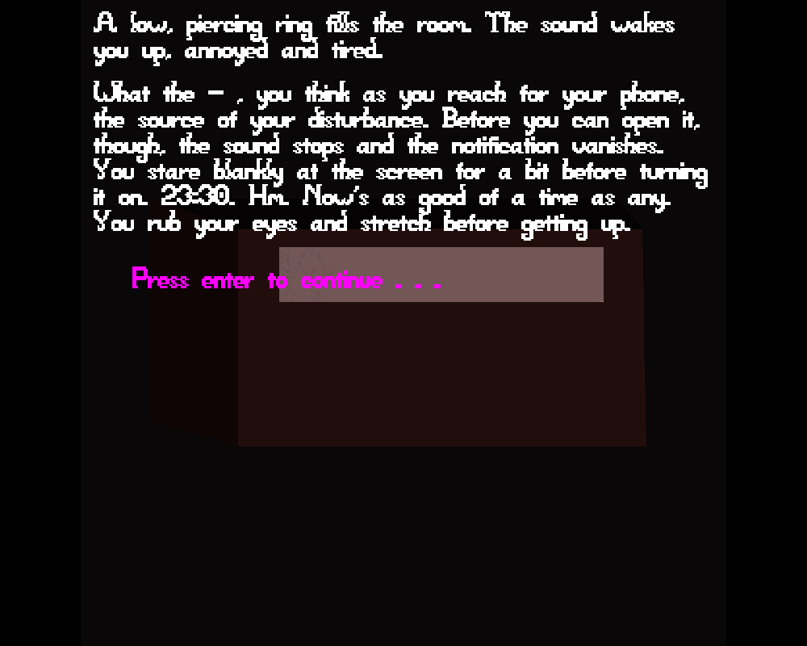

# A Trip to the Supermarket

Author: Malek Anabtawi

Design: It's about a trip to the supermarket.

Screen Shot:

How To Play:

Press enter to select the highlighted choices. You can press enter to make text appear immediately while it's being written.

Art Sources: None, and it shows. 

Notes of interest:

I've included a walkthrough in this folder, in case you want to see everything this game has to offer (though of course,
I recommend you play the game without it first).

Some changes I made to the base code: 
- Automatic line wrapping, that also makes sure that words don't spill onto the next line.
- Gradual text writing, so that the text appears slowly on the screen (you can also specify the 
number of seconds before the text starts being written).
- Something else I don't remember.

This game was built with [NEST](NEST.md).
